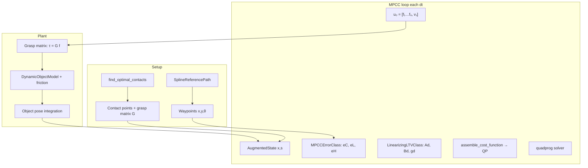

# Methodology Report: Legacy MPCC Object Pushing Controller

**Script:** `scripts/test/legacy_MPCC_solver.py`  
**Origin:** Jupyter notebook conversion (uses `nbimporter`, `StudyPlan_*` libraries)  
**Related modern work:** `docs/magnum_holonomic_control_methodology.md`, `docs/stochastic_magnum_afc_methodology.md`

---

## 1. Problem statement and historical context

This legacy controller solves **multi-contact planar object pushing** along a **reference spline path** using **Model Predictive Contouring Control (MPCC)**.

At the time of writing, the author had **not yet formalized AFC** (Augmented Force Closure / limit-surface wrench sufficiency). Contact placement uses an older LP-based contact optimizer (`find_optimal_contacts`) with modes `'2'`, `'E'`, `'E+2'` chosen by control goal — not the later Magnum Four / stochastic AFC pipeline.

**High-level idea (similar in spirit to current Magnum holonomic control):**

1. Fix contact locations on the object boundary (via contact optimization).
2. Command **normal contact forces** (and implicitly wrenches) to move the object.
3. Track a reference path in SE(2) with contour/lag errors.

**Key difference from current stack:** MPCC optimizes **object-level forces** directly in a receding-horizon QP. It does **not** solve per-robot wheel velocities or diff-drive matching. Robot kinematics are abstracted away; `DynamicObjectModel` integrates the pushed object under friction.

---

## 2. System architecture



### Control loop (`MPCCController.get_control_actions`)

Each timestep \(\Delta t\):

1. `_update_mpcc_state()` — sync measured object state + path parameter \(s\) from closest point on spline.
2. `_solve_mpcc_optimization()` — iterative refinement (`refinement_steps`, default 2):
   - `assemble_cost_function()` — linearize errors + dynamics per horizon stage.
   - `call_quad_solver()` — build and solve QP.
   - Blend/update predicted trajectories.
3. Apply first control: contact forces \(\mathbf{f}_0\), return to `DynamicObjectModel.simulate_and_animate`.

---

## 3. State, inputs, and augmented MPCC formulation

### 3.1 Augmented state

$$
\mathbf{x} = \begin{bmatrix} x & y & \theta & v_x^b & v_y^b & \omega & s \end{bmatrix}^\top \in \mathbb{R}^7,
$$

where \((v_x^b, v_y^b)\) are body-frame velocities, \(\omega\) is yaw rate, and \(s \in [0,1]\) is the **path parameter** along `SplineReferencePath`.

Class: `AugmentedState`.

### 3.2 Control input

$$
\mathbf{u} = \begin{bmatrix} f_1 & \cdots & f_n & v_s \end{bmatrix}^\top \in \mathbb{R}^{n+1},
$$

where \(f_i \ge 0\) are normal contact force magnitudes and \(v_s\) is the **virtual contour speed** (rate of progress along the path):

$$
\dot{s} = v_s.
$$

### 3.3 Decision variables (MATLAB-style horizon QP)

Per stage \(k = 0,\ldots,N-1\):

$$
\mathbf{z}_k = \begin{bmatrix} \mathbf{x}_k \\ \mathbf{u}_k \\ \Delta\mathbf{u}_k \end{bmatrix},
\qquad
\mathbf{z}_N = \begin{bmatrix} \mathbf{x}_N \\ \mathbf{u}_N \end{bmatrix}.
$$

Full vector \(\mathbf{z}\) stacks all stages. This enables **force rate** penalties/constraints via \(\Delta\mathbf{u}_k\).

---

## 4. Reference path and contour errors

Reference: `SplineReferencePath` — cubic spline through waypoints \((x_i, y_i, \theta_i)\).

At path parameter \(s\), reference pose:

$$
\mathbf{p}_{\mathrm{ref}}(s) = \begin{bmatrix} x_{\mathrm{ref}}(s) \\ y_{\mathrm{ref}}(s) \\ \theta_{\mathrm{ref}}(s) \end{bmatrix}.
$$

Tangent and normal from spline derivatives:

$$
\hat{\mathbf{t}}(s) = \frac{1}{\|\mathbf{r}'(s)\|}\begin{bmatrix} x'(s) \\ y'(s) \end{bmatrix}, \qquad
\hat{\mathbf{n}}(s) = \begin{bmatrix} -\hat{t}_y \\ \hat{t}_x \end{bmatrix}.
$$

Position error (implementation sign):

$$
\mathbf{e}_{\mathrm{pos}} = \mathbf{p}_{\mathrm{ref}}(s) - \begin{bmatrix} x \\ y \end{bmatrix}.
$$

**MPCC errors** (`MPCCErrorClass`):

$$
\boxed{
e_C = \mathbf{e}_{\mathrm{pos}} \cdot \hat{\mathbf{t}}, \qquad
e_L = \mathbf{e}_{\mathrm{pos}} \cdot \hat{\mathbf{n}}, \qquad
e_H = \mathrm{wrap}(\theta_{\mathrm{ref}}(s) - \theta).
}
$$

| Symbol | Name in code | Typical meaning |
|--------|--------------|-----------------|
| \(e_C\) | `contour_error` | Along-path (lag / progress) error |
| \(e_L\) | `lag_error` | Cross-track (contour) error |
| \(e_H\) | `heading_error` | Orientation error |

Weights from `ControlGoalWeights`: \(q_C, q_L, q_{V\theta}, \texttt{heading\_weight}\).

---

## 5. Cost function (linearized MPCC)

Errors are linearized around the current operating point \(\bar{\mathbf{x}}\):

$$
\mathbf{e}(\mathbf{x}) \approx \mathbf{e}(\bar{\mathbf{x}}) + \nabla_{\mathbf{x}} \mathbf{e} \big|_{\bar{\mathbf{x}}} (\mathbf{x} - \bar{\mathbf{x}}).
$$

For position errors, gradients w.r.t. \((x,y,\theta,v_x,v_y,\omega,s)\) are computed in `calculate_error_gradients` (7-dimensional).

### 5.1 Quadratic tracking cost

Stack \(\mathbf{e}_{\mathrm{pos}} = [e_C, e_L]^\top\) (heading cost partially implemented; QP uses 2×2 block in current code):

$$
J_{\mathrm{track}} = \mathbf{e}_{\mathrm{pos}}^\top \mathbf{Q}_{\mathrm{err}} \mathbf{e}_{\mathrm{pos}}, \qquad
\mathbf{Q}_{\mathrm{err}} = \mathrm{diag}(q_C, q_L).
$$

Linearized into QP form:

$$
\tilde{\mathbf{Q}} = (\nabla \mathbf{e})^\top \mathbf{Q}_{\mathrm{err}} (\nabla \mathbf{e}), \qquad
\mathbf{f}_{\mathrm{err}} = 2\mathbf{e}^\top \mathbf{Q}_{\mathrm{err}} (\nabla \mathbf{e}) - 2\bar{\mathbf{x}}^\top (\nabla \mathbf{e})^\top \mathbf{Q}_{\mathrm{err}} (\nabla \mathbf{e}).
$$

Per-stage QP blocks (`calculate_linearized_error_cost`):

$$
\mathbf{Q}_k = \mathrm{blkdiag}\bigl(2\tilde{\mathbf{Q}},\; 2\mathbf{R}_f,\; 2\mathbf{R}_{\Delta f}\bigr),
$$

$$
\mathbf{f}_k = \begin{bmatrix} \mathbf{f}_{\mathrm{err}} \\ \mathbf{0}_n \\ -q_{V\theta}\,\mathbf{e}_{v_s} \end{bmatrix},
$$

where \(\mathbf{R}_f = r_F \mathbf{I}_n\) penalizes force magnitude, \(\mathbf{R}_{\Delta f} = r_{dF}\mathbf{I}_n\) penalizes \(\Delta f\), and the last component of \(\mathbf{u}\) is \(v_s\) with **progress reward** \(-q_{V\theta}\, v_s\) (encourage forward motion along path).

Terminal stage multiplies costs by `qCNmult`.

### 5.2 Control goal presets

| Mode | \(q_C\) | \(q_L\) | `heading_weight` | Contact mode |
|------|---------|---------|------------------|--------------|
| `position_only` | 50 | 10 | 0.001 | `'E'` |
| `omega_only` | 5 | 100 | 50 | `'2'` |
| `full_pose` | 5.8 | 10 | 10 | `'E+2'` |

Class: `ControlGoalClass`.

---

## 6. Dynamics model and linearization

### 6.1 Continuous-time augmented dynamics

**Position kinematics** (body velocities mapped to world):

$$
\dot{x} = v_x^b \cos\theta - v_y^b \sin\theta, \qquad
\dot{y} = v_x^b \sin\theta + v_y^b \cos\theta, \qquad
\dot{\theta} = \omega.
$$

**Force-to-acceleration** via grasp matrix \(G \in \mathbb{R}^{3 \times n}\):

$$
G = [\, \mathbf{g}_1 \; \cdots \; \mathbf{g}_n \,], \qquad
\boldsymbol{\tau} = G\,\mathbf{f}, \qquad
\boldsymbol{\tau} = \begin{bmatrix} F_x \\ F_y \\ M \end{bmatrix}.
$$

**Ideal / damped options** (`LinearizingLTVClass`):

$$
\dot{v}_x^b = \frac{\tau_x}{m} - d_v v_x^b, \qquad
\dot{v}_y^b = \frac{\tau_y}{m} - d_v v_y^b, \qquad
\dot{\omega} = \frac{M}{I} - d_\omega \omega,
$$

with light damping \(d_v \approx 0.1\), \(d_\omega \approx 0.05\) (disabled at rest).

**Path parameter:**

$$
\dot{s} = v_s.
$$

**Friction-aware option** (`dynamics_option='friction_aware'`): linearizes static vs kinetic limit-surface friction (similar spirit to later AFC LS, but inside the MPC prediction model):

- Static: friction wrench opposes applied wrench inside cone; scale \(s = \|(\tau_x/f_{\max}, \tau_y/f_{\max}, M/m_{\max})\|\).
- Kinetic: friction opposes twist direction \((v_x, v_y, \omega c^2)\).

### 6.2 Discrete LTV model

Euler discretization at \(\Delta t\):

$$
\mathbf{x}_{k+1} = \mathbf{A}_d \mathbf{x}_k + \mathbf{B}_d \mathbf{u}_k + \mathbf{g}_d.
$$

Equality constraints in QP (`call_quad_solver`):

$$
\mathbf{x}_{k+1} = \mathbf{A}_k \mathbf{x}_k + \mathbf{B}_k \mathbf{u}_k + \mathbf{g}_k, \qquad
\mathbf{x}_0 = \bar{\mathbf{x}}_{\mathrm{meas}}.
$$

---

## 7. Constraints

`MPCCConstraintClass` builds bounds (inequality constraints in `lb`/`ub` form for `quadprog`):

| Constraint | Form |
|------------|------|
| Force magnitude | \(0 \le f_i \le f_{\max}\) |
| Force rate | \(\|\Delta f_i\| \le \dot{f}_{\max}\,\Delta t\) |
| State bounds | position, \(\theta\), velocities, \(s \in [0,1]\) |
| Virtual speed | \(v_s \in [v_{s,\min}, v_{s,\max}]\) |

Force limits from `ModelParams`: \(f_{\max} \approx 1.2 \times F_{\mathrm{static}}\) where \(F_{\mathrm{static}} = \mu_s m g\).

---

## 8. Force distribution (wrench → contacts)

`ForceDistributorPro` maps a desired wrench \(\boldsymbol{\tau}_d\) to contact forces before / during initial trajectory building.

**Core LP (v1):** find \(\mathbf{f} \ge 0\) such that \(G\mathbf{f} = \hat{\boldsymbol{\tau}}_d\) (unit direction), then scale to \(\|\boldsymbol{\tau}_d\|\).

**v2/v3:** add force caps and rate limits tied to `DynamicObjectModel` friction limits.

This is the legacy analogue of "how do we realize a wrench with fixed contacts?" — but it optimizes **force magnitudes only**, not robot motion.

---

## 9. Contact selection (pre-AFC)

```python
find_optimal_contacts(obj, mode='E'|'2'|'E+2', target_wrench=[0,0,0], ...)
```

| Control goal | Mode | Typical # forces |
|--------------|------|------------------|
| `position_only` | `'E'` | # edges |
| `omega_only` | `'2'` | 2 |
| `full_pose` | `'E+2'` | # edges + 2 |

`GraspMatrixCalculator.build_wrench_matrix(contact_points)` builds \(G\).

**Not present:** limit-surface containment, degeneracy index \(D\), Latin-square search, or per-robot spacing.

---

## 10. QP assembly and solution

Objective over horizon:

$$
\min_{\mathbf{z}} \quad \frac{1}{2}\mathbf{z}^\top \mathbf{H} \mathbf{z} + \mathbf{f}^\top \mathbf{z}
$$

subject to:

- Dynamics equalities (stacked \(\mathbf{A}_{\mathrm{eq}}\mathbf{z} = \mathbf{b}_{\mathrm{eq}}\))
- Box constraints \(\mathbf{lb} \le \mathbf{z} \le \mathbf{ub}\)
- Normalization via `StateInputNormalization` (diagonal scaling matrices \(\mathbf{T}_x, \mathbf{T}_u, \mathbf{T}_{\Delta u}\))

Solver: `quadprog(H, f, ...)` — custom/active-set QP wrapper.

Output: force trajectory \(\mathbf{f}_{0:N-1}\) and virtual speeds \(v_{s,0:N-1}\). First step applied to simulation.

---

## 11. Simplified vs true physics

| Option | Prediction model |
|--------|----------------|
| `physics_option='simplified'` | `_apply_mpcc_dynamics_golden`: direct \(G\mathbf{f}\) → accel, Euler, damped |
| `physics_option='true'` | `DynamicObjectModel.predict_next_state` with friction regimes |

Simulation loop (`demo_full_mpcc_controller`):

```python
dynamics.simulate_and_animate(controller, duration, dt)
```

---

## 12. Comparison to current Magnum / AFC stack

| Aspect | Legacy MPCC | Current Magnum holonomic |
|--------|-------------|--------------------------|
| Contact placement | `find_optimal_contacts` (LP modes) | AFC / Magnum Four / stochastic + cache |
| Sufficiency test | Friction limits in distributor | GWS ⊇ threshold × LS |
| Control variable | Contact forces \(f_i\), virtual \(v_s\) | Robot \((v_x, v_y, \omega)\) per agent |
| Path tracking | MPCC contour/lag on spline | PathFollowingController + Phase7 |
| Robots | Abstracted (object-only sim) | PyBullet multi-robot |
| Optimization | Receding-horizon QP | Geometric + velocity matching |

**Conceptual lineage:** Both fix contacts and drive the object along a reference. MPCC is **force-space MPC at the object level**; Magnum is **velocity-space control at the robot level** with AFC guaranteeing wrench feasibility offline.

---

## 13. Known limitations (legacy)

1. **Notebook artifacts:** `nbimporter`, duplicate imports, demo cells at file top; depends on `StudyPlan_*` paths not in current `contact_maintain` package layout.
2. **Heading cost:** `calculate_linearized_error_cost` uses 2×2 position error block; `heading_weight` is computed but not fully in the running QP cost (noted in code comments).
3. **No robot layer:** Cannot deploy directly on diff-drive / holonomic robots without a force→velocity interface.
4. **Contact optimality:** `target_wrench=[0,0,0]` for contact selection does not encode the actual pushing wrench or AFC margin.
5. **Contour/lag naming:** Implementation follows custom `golden_*` convention; verify signs when comparing to textbook MPCC papers.

---

## 14. Key equations (quick reference)

$$
\boxed{
\begin{aligned}
&\text{State:} && \mathbf{x} = [x, y, \theta, v_x^b, v_y^b, \omega, s]^\top \\[6pt]
&\text{Input:} && \mathbf{u} = [f_1,\ldots,f_n, v_s]^\top,\quad \dot{s} = v_s \\[6pt]
&\text{Wrench:} && \boldsymbol{\tau} = G\mathbf{f} \\[6pt]
&\text{Errors:} && e_C = \mathbf{e}_{\mathrm{pos}}\cdot\hat{\mathbf{t}},\; e_L = \mathbf{e}_{\mathrm{pos}}\cdot\hat{\mathbf{n}},\; e_H = \mathrm{wrap}(\theta_{\mathrm{ref}}-\theta) \\[6pt]
&\text{Cost:} && q_C e_C^2 + q_L e_L^2 + r_F\|\mathbf{f}\|^2 + r_{dF}\|\Delta\mathbf{f}\|^2 - q_{V\theta} v_s \\[6pt]
&\text{Dynamics:} && \mathbf{x}_{k+1} = A_d \mathbf{x}_k + B_d \mathbf{u}_k + g_d
\end{aligned}
}
$$

---

## 15. Suggested migration path (if reviving this controller)

If integrating with the modern AFC + multi-robot stack:

1. Replace `find_optimal_contacts` with cached AFC `t_params` from `magnum_four_cache.json` or stochastic finder.
2. Replace `ForceDistributorPro` wrench allocation with AFC-aware bounds (\(f_i \le \lambda \mu_s mg\)).
3. Add a **low-level robot controller** (Phase7 / diff-drive matching) that tracks the wrench or twist implied by MPCC's first-step \(\mathbf{f}_0\).
4. Align friction model with `docs/afc_problem_B.md` limit surface for consistent prediction.
5. Port off `StudyPlan_*` to `object_utils`, `paths_lib`, and current package imports.

---

*Generated from `legacy_MPCC_solver.py` in `contact_maintain` (June 2025). This documents the pre-AFC object-level MPCC approach; it is legacy reference material, not the production controller path.*
