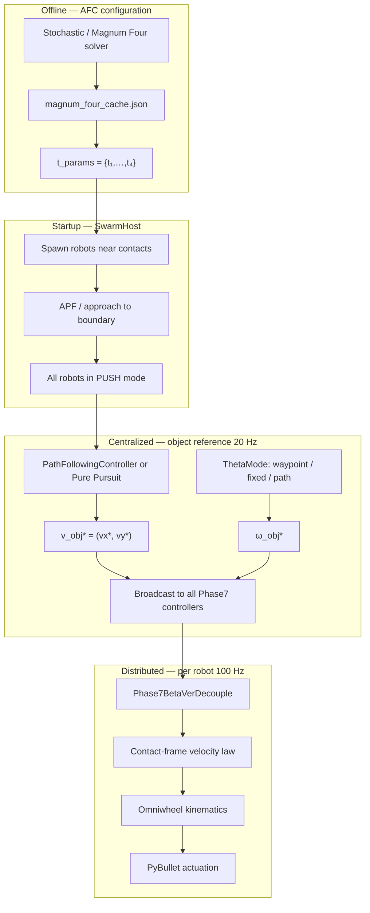

# Methodology Report: Centralized Holonomic Magnum Control

**Script:** `scripts/test/test_magnum_holonomic_control.py`  
**Path planning:** `src/contact_maintain/holonomic_path_control.py`, `src/contact_maintain/motion_planner.py`  
**Low-level pushing:** `Phase7BetaVerDecouple` (in test script)  
**AFC contact cache:** `urdf/magnum_four_cache.json`  
**Related AFC theory:** `docs/afc_problem_B.md`, `docs/stochastic_magnum_afc_methodology.md`

---

## 1. Problem statement

Given a **pre-computed AFC configuration** — four boundary parameters \(t_1,\ldots,t_4 \in [0,1)\) that satisfy wrench sufficiency — coordinate four holonomic pushers so the object follows a reference path in the plane while maintaining contact at those locations.

The controller is **hierarchical and centralized at the object level**:

1. A **single high-level planner** produces the desired object twist \(\mathbf{v}_{\mathrm{obj}}^* = (v_x^*, v_y^*, \omega_{\mathrm{obj}}^*)\).
2. Four **identical low-level contact controllers** (one per robot) map that twist into individual holonomic velocity commands that maintain contact geometry.

This separates **what motion the object should make** (centralized) from **how each robot must move on its edge** (decentralized execution with shared reference).

---

## 2. System architecture

### Timing

| Layer | Rate | Notes |
|-------|------|-------|
| PyBullet physics | 240 Hz | `TIMESTEP = 1/240` |
| Robot control (`Phase7`, approach) | 100 Hz | `CTRL_FREQ = 100` |
| Object path / \(\omega\) reference | 20 Hz | `PID_DECIMATION = 5` |

---

## 3. AFC configuration loading

### 3.1 Cached contact parameters

Each shape stores four arc-length parameters on \(\partial\mathcal{O}\):

$$
\mathbf{t} = (t_1, t_2, t_3, t_4), \quad t_i \in [0, 1).
$$

File: `urdf/magnum_four_cache.json` (keyed by shape name). At runtime:

1. Load cached `t_params` if present.
2. Else run `find_the_magnum_four_v3` and write cache.

Each \(t_i\) maps to a contact frame via `ContactPointParameterization`:

$$
\mathbf{p}_i^{\mathrm{body}} = \gamma(t_i), \quad
\mathbf{n}_i^{\mathrm{in}}, \quad
\boldsymbol{\tau}_i = \mathbf{t}(t_i).
$$

Robot \(i\) is assigned `target_t_param = t_i` and must push at that boundary point for the entire experiment.

### 3.2 Spawn geometry

Robot \(i\) spawns at:

$$
\mathbf{x}_i^{\mathrm{spawn}} = \mathbf{p}_i^{\mathrm{world}} + (r_{\mathrm{robot}} + d_{\mathrm{approach}})\,\mathbf{n}_i^{\mathrm{out}},
$$

with \(r_{\mathrm{robot}} = 0.06\,\mathrm{m}\), \(d_{\mathrm{approach}} = 0.02\,\mathrm{m}\). Initial heading points along \(\mathbf{n}_i^{\mathrm{in}}\).

**Prerequisite:** The AFC solver guarantees the grasp can resist LS wrenches; the controller assumes these four contacts remain valid throughout pushing.

---

## 4. High-level centralized control (object reference)

Once all robots enter `push` mode, a **single** path follower generates the object's desired translational velocity. Orientation is handled separately via `ThetaMode`.

### 4.1 Reference paths

Two XY references (`--xy-path`):

| Path | Construction |
|------|--------------|
| **Zigzag** | Piecewise straight segments, amplitude \(A_y\), \(N\) segments over \([x_0, x_1]\) |
| **Sine** | Dense polyline approximating \(y = A\sin(\omega_x x)\) |

Paths are translated so \(x_0\) aligns with the object's start position.

### 4.2 Planner A: Hybrid path follower (default)

`PathFollowingController` on a `HybridPath` (straight segments; optional arc fit for sine).

**Time-based progress** (avoids \(v(s=0)=0\) deadlock):

$$
t \leftarrow t + \Delta t, \qquad s = s(t) \text{ from trapezoidal profile}.
$$

Per segment trapezoid:

$$
v(t) = \begin{cases}
v_0 + a\, t & t \le t_{\mathrm{acc}} \\[4pt]
v_{\mathrm{cruise}} & t_{\mathrm{acc}} < t \le t_{\mathrm{acc}} + t_{\mathrm{cruise}} \\[4pt]
v_{\mathrm{cruise}} - a\,(t - t_{\mathrm{acc}} - t_{\mathrm{cruise}}) & \text{decel}
\end{cases}
$$

Arc length in segment:

$$
s(t) = v_0 t + \tfrac{1}{2} a t^2 \quad\text{(accel)}, \qquad
s = s_{\mathrm{acc}} + v_{\mathrm{cruise}}(t - t_{\mathrm{acc}}) \quad\text{(cruise)}.
$$

**Direction** from `PathDirectionProvider`:

$$
\mathbf{v}_{\mathrm{lin}} = v(t)\,\hat{\mathbf{t}}(s),
$$

where \(\hat{\mathbf{t}}(s)\) is the path unit tangent.

For **straight** segments: \(\kappa = 0\), \(\omega_{\mathrm{path}} = 0\).

For **circular arc** of radius \(\rho = 1/\kappa\):

$$
\boxed{\omega_{\mathrm{path}} = \sigma \cdot v \cdot \kappa, \qquad \sigma = \pm 1 \text{ (CCW/CW)}.}
$$

This is the standard relation \(\omega = v/\rho\) (Lemma: arc shape depends on ratio \(v/\omega\) only).

**Output:** \(\mathbf{v}_{\mathrm{cmd}} = (v_x, v_y, \omega_{\mathrm{path}})\).

> **Note:** In `test_magnum_holonomic_control.py`, \(\omega_{\mathrm{path}}\) is **not** used directly for object orientation in default `ThetaMode` settings. Only \((v_x, v_y)\) feed the object; \(\omega_{\mathrm{obj}}^*\) comes from Section 4.4.

### 4.3 Planner B: Holonomic pure pursuit (experimental)

`HolonomicPurePursuitPolyline` on a dense polyline:

**Lookahead:**

$$
L_f = k_f \|\mathbf{v}_{\mathrm{curr}}\| + L_d.
$$

**Velocity direction** toward lookahead point \(\mathbf{p}_{\mathrm{look}}\):

$$
\hat{\mathbf{d}} = \frac{\mathbf{p}_{\mathrm{look}} - \mathbf{x}_{\mathrm{obj}}}{\|\mathbf{p}_{\mathrm{look}} - \mathbf{x}_{\mathrm{obj}}\|},
\qquad
\mathbf{v}_{\mathrm{lin}} = v(s)\,\hat{\mathbf{d}}.
$$

Speed \(v(s)\) from symmetric trapezoid `ScalarTrapezoidProfile` on total path length \(L\):

$$
v_{\mathrm{cruise}} = \min\bigl(v_{\max},\; \sqrt{a_{\max} L}\bigr).
$$

Pure pursuit returns \(\omega = 0\) unless overridden; orientation again comes from `ThetaMode`.

### 4.4 Object orientation modes (`ThetaMode`)

Translational reference \((v_x^*, v_y^*)\) is decoupled from heading. Angular reference \(\omega_{\mathrm{obj}}^*\) uses a **PD controller on wrapped angle error**:

$$
e_\theta = \mathrm{wrap}(\theta_{\mathrm{goal}} - \theta), \qquad
\boxed{\omega_{\mathrm{obj}}^* = K_p e_\theta - K_d \,\omega_{\mathrm{curr}},}
$$

with defaults \(K_p = 0.8\), \(K_d = 0.2\), \(|\omega| \le 0.15\,\mathrm{rad/s}\).

| Mode | \(\theta_{\mathrm{goal}}\) |
|------|---------------------------|
| **waypoint** | Piecewise constant headings at zigzag/sine milestones vs arc length \(s\) |
| **fixed** | Constant `--fixed-theta` |
| **path** | \(\theta_{\mathrm{goal}}(s) = A_\theta \sin(k_\theta\, s)\) (decoupled from path tangent) |

Heading alignment for PID uses `align_heading_to_current` (nearest \(2\pi\) branch).

### 4.5 Hybrid segment retouch (optional)

At straight/arc **segment boundaries**, the controller can pause object motion and re-run quick approach so all robots re-establish contact before continuing (`--hybrid-retouch-duration`). Object twist is zero during retouch.

### 4.6 Centralized broadcast

Every `PID_DECIMATION` cycles, the same command is written to all Phase7 instances:

$$
\text{controller}_i.\texttt{desired\_object\_velocity} \leftarrow (v_x^*, v_y^*), \quad
\text{controller}_i.\texttt{desired\_object\_angular\_velocity} \leftarrow \omega_{\mathrm{obj}}^*.
$$

This is the **centralized** part: one object-level planner, four identical references.

---

## 5. Low-level control: Phase7BetaVerDecouple

Each robot runs an independent **tripartite decoupled controller** in the **contact frame** \(\mathcal{C}_i = (\hat{\mathbf{n}}_i^{\mathrm{in}}, \hat{\boldsymbol{\tau}}_i)\).

### 5.1 Contact kinematics

Contact point in world frame (object at \(\mathbf{x}_O\), orientation \(\theta\)):

$$
\mathbf{p}_{c,i}^{\mathrm{world}} = \mathbf{x}_O + R(\theta)\,\mathbf{p}_{c,i}^{\mathrm{body}}.
$$

**Desired contact point velocity** from desired object twist:

$$
\mathbf{v}_{c,i}^* = \mathbf{v}_{\mathrm{obj}}^* + \omega_{\mathrm{obj}}^* \begin{pmatrix} -r_y \\ r_x \end{pmatrix},
\qquad \mathbf{r} = \mathbf{p}_{c,i}^{\mathrm{world}} - \mathbf{x}_O.
$$

In body frame (as implemented):

$$
\mathbf{v}_{c,i}^{\mathrm{body}*} = R(\theta)^\top \mathbf{v}_{\mathrm{obj}}^* + \omega_{\mathrm{obj}}^* \begin{pmatrix} -r_y^{\mathrm{body}} \\ r_x^{\mathrm{body}} \end{pmatrix},
\qquad
\mathbf{v}_{c,i}^* = R(\theta)\,\mathbf{v}_{c,i}^{\mathrm{body}*}.
$$

This is rigid-body kinematics: every contact on the object must move consistently with the commanded SE(2) twist.

### 5.2 Intended robot position (virtual spring)

Target robot center (clamped against inward normal with penetration offset \(\delta_p \approx 3\,\mathrm{mm}\)):

$$
\mathbf{x}_i^{\mathrm{int}} = \mathbf{p}_{c,i}^{\mathrm{world}} + r_{\mathrm{robot}}\,\hat{\mathbf{n}}_i^{\mathrm{out}} - \delta_p\,\hat{\mathbf{n}}_i^{\mathrm{in}}.
$$

Position error:

$$
\mathbf{e}_i = \mathbf{x}_i^{\mathrm{int}} - \mathbf{x}_i^{\mathrm{robot}}.
$$

Decompose in contact frame:

$$
e_{\parallel,i} = \mathbf{e}_i \cdot \hat{\mathbf{n}}_i^{\mathrm{in}}, \qquad
e_{\perp,i} = \mathbf{e}_i \cdot \hat{\boldsymbol{\tau}}_i.
$$

### 5.3 Tripartite velocity law (contact frame)

**Feed-forward** (rotation lock — project desired contact velocity):

$$
v_{\parallel,i}^{\mathrm{ff}} = \mathbf{v}_{c,i}^* \cdot \hat{\mathbf{n}}_i^{\mathrm{in}}, \qquad
v_{\perp,i}^{\mathrm{ff}} = \mathbf{v}_{c,i}^* \cdot \hat{\boldsymbol{\tau}}_i.
$$

**Longitudinal (normal / “cling”) axis:**

$$
v_{\parallel,i}^{\mathrm{pos}} = K_{p,\parallel}\, e_{\parallel,i}, \qquad K_{p,\parallel} = 2.5.
$$

Velocity error along normal (with PI when in contact):

$$
v_{\parallel,i}^{\mathrm{act}} = \mathbf{v}_{c,i}^{\mathrm{act}} \cdot \hat{\mathbf{n}}_i^{\mathrm{in}}, \qquad
e_{v,\parallel} = v_{\parallel,i}^{\mathrm{act}} - v_{\parallel,i}^{\mathrm{ff}},
$$

$$
v_{\parallel,i}^{\mathrm{PI}} = K_{p,v}\, e_{v,\parallel} + K_{i,v} \int e_{v,\parallel}\, dt.
$$

**Implemented longitudinal command** (feed-forward dominant):

$$
\boxed{v_{\parallel,i} = \mathrm{clip}\bigl(v_{\parallel,i}^{\mathrm{ff}},\; \pm v_{\parallel,\max}\bigr), \quad v_{\parallel,\max} = 0.4\,\mathrm{m/s}.}
$$

Position and PI corrections are computed but the current implementation assigns \(v_{\parallel} \leftarrow v_{\parallel}^{\mathrm{ff}}\) only (clamping contact maintained primarily by feed-forward matching object motion).

**Lateral (tangent / “slide”) axis:**

$$
\boxed{v_{\perp,i} = v_{\perp,i}^{\mathrm{ff}} + K_{p,\perp}\, e_{\perp,i}, \qquad K_{p,\perp} = 1.5.}
$$

This prevents **slipping off** the edge when the object rotates: the robot crab-walks along \(\hat{\boldsymbol{\tau}}_i\) to track the moving contact point.

**World-frame robot velocity:**

$$
\boxed{\mathbf{v}_i^{\mathrm{cmd}} = v_{\parallel,i}\,\hat{\mathbf{n}}_i^{\mathrm{in}} + v_{\perp,i}\,\hat{\boldsymbol{\tau}}_i, \qquad
\|\mathbf{v}_i^{\mathrm{cmd}}\| \le v_{\max}.}
$$

### 5.4 Robot heading (bumper alignment)

Point robot toward contact:

$$
\theta_i^{\mathrm{des}} = \atan2\bigl(p_{c,y} - y_i,\; p_{c,x} - x_i\bigr), \qquad
e_{\psi,i} = \mathrm{wrap}(\theta_i^{\mathrm{des}} - \psi_i).
$$

$$
\boxed{\omega_i = K_{h}\, e_{\psi,i}, \qquad K_h = 10.0, \quad |\omega_i| \le 1.0\,\mathrm{rad/s}.}
$$

### 5.5 Contact detection (hysteresis)

Binary contact from normal force \(F_n\):

$$
\text{in\_contact} = \begin{cases}
F_n > F_{\mathrm{off}} = 0.2\,\mathrm{N} & \text{if previously in contact} \\
F_n > F_{\mathrm{on}} = 2.0\,\mathrm{N} & \text{otherwise}
\end{cases}
$$

Integral on longitudinal velocity error decays when not in contact (`× 0.95` per step).

### 5.6 Summary: per-robot command

$$
\mathbf{u}_i = \begin{pmatrix} v_{x,i}^{\mathrm{cmd}} \\ v_{y,i}^{\mathrm{cmd}} \\ \omega_i \end{pmatrix}
= T_i(\hat{\mathbf{n}}_i^{\mathrm{in}}, \hat{\boldsymbol{\tau}}_i)\,
\begin{pmatrix} v_{\parallel,i} \\ v_{\perp,i} \\ \omega_i \end{pmatrix}.
$$

All four robots share \((\mathbf{v}_{\mathrm{obj}}^*, \omega_{\mathrm{obj}}^*)\) but have **different** contact frames, hence different \(\mathbf{u}_i\).

---

## 6. Holonomic actuation (omniwheel kinematics)

Body/world velocity command \((v_x, v_y, \omega)\) maps to four wheel angular rates. Wheels at angles \(\phi_k \in \{45°, 135°, 225°, 315°\}\) relative to robot heading \(\psi\):

$$
\omega_k^{\mathrm{wheel}} = \frac{1}{r_w}\Bigl(
-v_x \sin(\psi + \phi_k) + v_y \cos(\psi + \phi_k) + \omega \cdot r_b
\Bigr),
$$

with wheel radius \(r_w\) and robot base radius \(r_b\).

**Inverse** (pseudo-inverse of Jacobian) used for telemetry.

This is standard omniwheel forward kinematics; holonomic robots can execute \(\mathbf{v}_i^{\mathrm{cmd}}\) with arbitrary heading correction \(\omega_i\) simultaneously.

---

## 7. Startup and mode switching

Before pushing, `SwarmHost` with `startup_mode="quick"` drives each `RobotAgent` through:

1. **Approach** — navigate toward offset APF target near assigned \(t_i\)
2. **Push** — hand off to `Phase7BetaVerDecouple`

Holonomic path following **starts only when** all agents report `goal_type == "push"`.

---

## 8. Control flow equations (end-to-end)

At each control tick \(k\) (100 Hz):

**Step 1 — Object reference** (every 5 ticks, if pushing started):

$$
(v_x^*, v_y^*) \leftarrow \text{PathFollower}(t_k), \qquad
\omega_{\mathrm{obj}}^* \leftarrow \text{OrientationPID}(\theta_{\mathrm{goal}}(s_k), \theta, \omega).
$$

**Step 2 — Per robot** \(i = 1,\ldots,4\):

$$
\mathbf{v}_{c,i}^* \leftarrow \mathbf{v}_{\mathrm{obj}}^* + \omega_{\mathrm{obj}}^* \hat{\mathbf{z}} \times \mathbf{r}_i,
$$

$$
v_{\parallel,i} \leftarrow (\mathbf{v}_{c,i}^* \cdot \hat{\mathbf{n}}_i), \qquad
v_{\perp,i} \leftarrow (\mathbf{v}_{c,i}^* \cdot \hat{\boldsymbol{\tau}}_i) + K_{p,\perp} e_{\perp,i},
$$

$$
\mathbf{v}_i^{\mathrm{cmd}} \leftarrow v_{\parallel,i}\,\hat{\mathbf{n}}_i + v_{\perp,i}\,\hat{\boldsymbol{\tau}}_i, \qquad
\omega_i \leftarrow K_h\, e_{\psi,i}.
$$

**Step 3 — Actuation:**

$$
\boldsymbol{\omega}^{\mathrm{wheel}}_i \leftarrow f_{\mathrm{omni}}(\mathbf{v}_i^{\mathrm{cmd}}, \psi_i).
$$

---

## 9. Design rationale

| Design choice | Rationale |
|---------------|-----------|
| Centralized object twist | One planner ensures coherent object motion; AFC guarantees wrench feasibility |
| Contact-frame decoupling | Normal = clamping force; tangent = track sliding contact during rotation |
| Feed-forward contact velocity | Matches object twist → avoids fighting between position and velocity loops |
| Decoupled \(\theta\) modes | Test heading tracking independent of path tangent (zigzag corners vs sine body rotation) |
| Cached `t_params` | AFC search is expensive; JSON cache amortizes offline computation |
| Multi-rate control | Slow object planner (20 Hz), fast contact tracking (100 Hz), physics (240 Hz) |

---

## 10. Implementation map

| Role | Code |
|------|------|
| Test orchestration | `test_magnum_holonomic_control.py` |
| AFC cache I/O | `urdf/magnum_four_cache.json` |
| Path geometry | `holonomic_path_control.py` |
| Hybrid follower | `motion_planner.PathFollowingController` |
| Pure pursuit | `holonomic_path_control.HolonomicPurePursuitPolyline` |
| Orientation PD | `holonomic_path_control.orientation_pid_omega` |
| Low-level push | `Phase7BetaVerDecouple` (test script) |
| Approach / swarm | `SwarmHost`, `RobotAgent` |
| Omni kinematics | `omniwheel_robot.compute_wheel_velocities` |
| Physics | PyBullet @ 240 Hz |

---

## 11. Key equations (quick reference)

$$
\boxed{
\begin{aligned}
&\text{Object twist broadcast:} && \mathbf{v}_{\mathrm{obj}}^*,\; \omega_{\mathrm{obj}}^* \\[6pt]
&\text{Contact velocity:} && \mathbf{v}_{c,i}^* = \mathbf{v}_{\mathrm{obj}}^* + \omega_{\mathrm{obj}}^* \hat{\mathbf{z}}\times\mathbf{r}_i \\[6pt]
&\text{Contact-frame robot vel:} && \mathbf{v}_i = v_\parallel \hat{\mathbf{n}}_i + v_\perp \hat{\boldsymbol{\tau}}_i \\[6pt]
&\text{Lateral tracking:} && v_\perp = \underbrace{\mathbf{v}_{c,i}^*\cdot\hat{\boldsymbol{\tau}}_i}_{\text{feed-forward}} + K_{p,\perp}\,(\mathbf{x}_i^{\mathrm{int}} - \mathbf{x}_i)\cdot\hat{\boldsymbol{\tau}}_i \\[6pt]
&\text{Path arc:} && \omega_{\mathrm{path}} = \sigma\, v\, \kappa \\[6pt]
&\text{Orientation loop:} && \omega_{\mathrm{obj}}^* = K_p\, e_\theta - K_d\,\omega
\end{aligned}
}
$$

---

## 12. Limitations

1. **Planar SE(2)** — no vertical dynamics; object height fixed for wheel contact stability.
2. **Fixed contacts** — \(t_i\) do not adapt if the object slips significantly off the AFC placement.
3. **Phase7 longitudinal simplification** — PI/position terms on normal axis are computed but not added to \(v_\parallel\) in current code; contact relies heavily on velocity feed-forward.
4. **Decoupled heading** — default modes ignore path curvature for \(\omega_{\mathrm{obj}}^*\); full path-coupled \(\omega\) requires using `PathFollowingController`'s \(\omega_{\mathrm{path}}\) directly (not default in test script).
5. **Magnum Four vs stochastic cache** — this test caches Magnum Four `t_params`; stochastic AFC results can be stored in the same JSON format for interchangeability.

---

*Generated from the implementation in `contact_maintain` (June 2025).*
