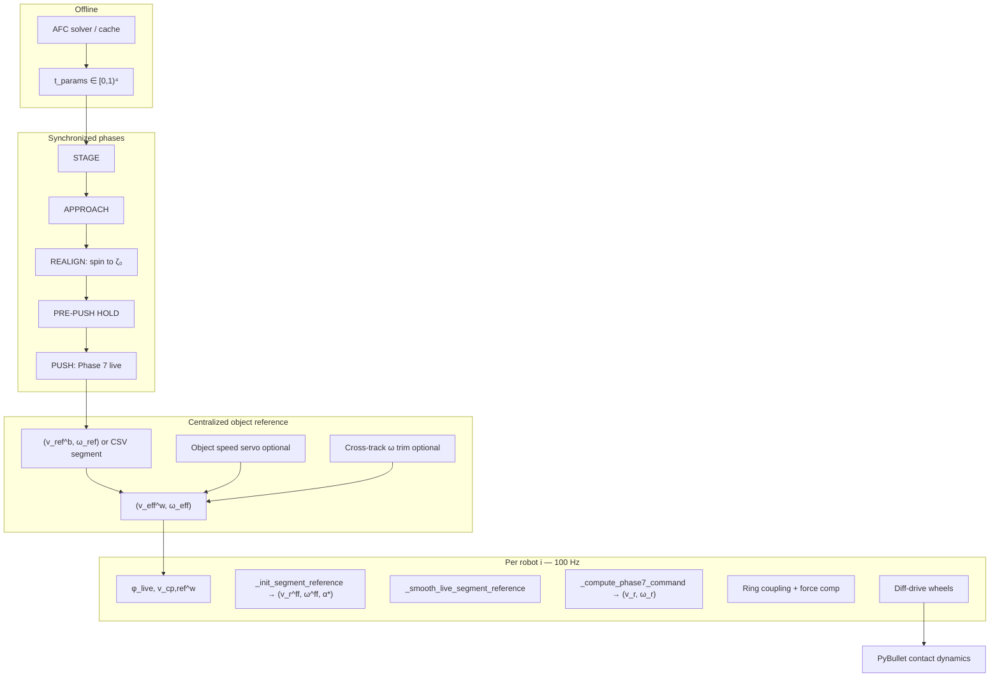

# Methodology Report: Multi-Pusher Diff-Drive Constant-Twist Control (Live-Update)

**Script:** `scripts/test/test_multi_pusher_single_movement_diffdrive_liveupdate.py`  
**Theory:** `scripts/test/basic_test/test_matchingvelo_report.md`  
**SE(2) segment solver:** `src/contact_maintain/diffdrive_path_control.py`  
**AFC contacts:** `urdf/magnum_four_cache.json` (or `find_the_magnum_four_v3`)  
**Related:** `docs/stochastic_magnum_afc_methodology.md`, `docs/magnum_holonomic_control_methodology.md`

---

## 1. Problem statement

Given four **differential-drive** pushers and a pre-computed AFC configuration (four boundary parameters \(t_i\)), command each robot so the **object** executes a **constant body twist**

$$
(\mathbf{v}^b, \omega) \in \mathbb{R}^2 \times \mathbb{R},
$$

while each robot's **contact-patch velocity** matches the object's contact velocity at its assigned point.

Unlike the holonomic Magnum controller (which can directly realize \((v_x, v_y, \omega)\)), each diff-drive robot has only **two controls**: forward speed \(v_r\) and body rate \(\omega_r\). The matching problem is **fully determined** (2 constraints, 2 DOF) and admits a closed-form feed-forward solution — but only if heading \(\zeta\) and contact angle \(\alpha\) stay on the manifold defined by that solution.

The **live-update** variant re-solves the feed-forward reference every control tick from **current** contact geometry \(\varphi_{\mathrm{live}}\), reducing stale-reference drift at the cost of introducing high-frequency reference jitter that must be filtered.

**Current status:** The controller is structurally correct (velocity matching + contact-frame feedback) but often **does not fully stabilize** contact position and object motion under physics — especially for redundant/obstructing contacts, wheel slip, and multi-robot coupling. Section 12 lists targeted improvements.

---

## 2. System architecture

### Timing

| Layer | Rate |
|-------|------|
| Physics | 240 Hz |
| Control (`Phase 7`, approach) | 100 Hz |

---

## 3. AFC configuration and contact geometry

Same cache pattern as holonomic tests: `magnum_four_cache.json` stores four `t_param` values per shape. Each robot \(i\) is pinned to \(t_i\) on \(\partial\mathcal{O}\).

**Body-frame contact data** (updated on realign if `update_contact_on_realign`):

$$
\mathbf{r}_i^b = \gamma(t_i), \quad \hat{\mathbf{n}}_i^{b,\mathrm{out}}, \quad \hat{\mathbf{n}}_i^{b,\mathrm{in}} = -\hat{\mathbf{n}}_i^{b,\mathrm{out}}.
$$

**World frame** (object pose \(\mathbf{p}_O, \theta\), rotation \(R(\theta)\)):

$$
\mathbf{p}_{c,i}^{\mathrm{w}} = \mathbf{p}_O + R(\theta)\,\mathbf{r}_i^b, \qquad
\hat{\mathbf{n}}_i^{\mathrm{w}} = R(\theta)\,\hat{\mathbf{n}}_i^{b,\mathrm{out}}.
$$

**Approach direction** (inward normal angle):

$$
\varphi_i = \atan2\bigl(-\hat{n}_{i,y}^{\mathrm{w}},\; -\hat{n}_{i,x}^{\mathrm{w}}\bigr).
$$

**Robot intended center** (disc bumper radius \(R_r = 0.06\,\mathrm{m}\)):

$$
\mathbf{x}_i^{\mathrm{int}} = \mathbf{p}_{c,i}^{\mathrm{w}} + R_r\,\hat{\mathbf{n}}_i^{\mathrm{w,out}}.
$$

**Contact angle** on robot body:

$$
\alpha_i = \varphi_i - \zeta_i, \qquad \zeta_i = \text{robot heading}.
$$

---

## 4. Object kinematics (constant twist)

### 4.1 CoM motion

$$
\dot{\mathbf{p}}_O = R(\theta)\,\mathbf{v}^b, \qquad \dot{\theta} = \omega.
$$

### 4.2 Contact-point velocity

Body-frame contact velocity (constant for fixed \(t_i\) and constant twist):

$$
\mathbf{v}_{c,i}^{b} = \mathbf{v}^b + \omega \begin{pmatrix} -r_{i,y}^b \\ r_{i,x}^b \end{pmatrix}.
$$

World frame:

$$
\boxed{\mathbf{v}_{c,i}^{\mathrm{w}} = R(\theta)\,\mathbf{v}^b + \omega \begin{pmatrix} -r_{c,y} \\ r_{c,x} \end{pmatrix}, \quad \mathbf{r}_c = \mathbf{p}_{c}^{\mathrm{w}} - \mathbf{p}_O.}
$$

### 4.3 SE(2) segment primitive (CSV mode)

For a segment from pose \((\mathbf{p}_0, \theta_0)\) to \((\mathbf{p}_1, \theta_1)\) with fixed speed \(\|\mathbf{v}^b\| = v_s\), `solve_constant_body_twist_from_SE2` finds \((\mathbf{v}^b, \omega, T)\) such that the screw motion reaches the end pose in time \(T\). Pure translation iff \(\theta_1 - \theta_0 \approx 0\); otherwise the path is a **circular arc** in world frame.

---

## 5. Velocity matching — core theorem (diff-drive)

From `test_matchingvelo_report.md` §5–6.

### 5.1 Robot contact velocity model

Disc robot with heading \(\zeta\), commands \((v_r, \omega_r)\):

$$
\mathbf{v}_{\mathrm{contact}}^{\mathrm{robot}} = v_r \begin{pmatrix} \cos\zeta \\ \sin\zeta \end{pmatrix} + \omega_r \begin{pmatrix} -R_r\sin\varphi \\ R_r\cos\varphi \end{pmatrix}, \qquad \varphi = \zeta + \alpha.
$$

### 5.2 All-time matching conditions

**Condition 1 (angular):**

$$
\boxed{\omega_r = \omega.}
$$

**Condition 2 (initial linear)** at \(t=0\), with \(\varphi_0\) from geometry:

$$
a = v_{c,x}(0) + \omega R_r\sin\varphi_0, \qquad b = v_{c,y}(0) - \omega R_r\cos\varphi_0.
$$

Two branches:

| Branch | Heading | Forward speed |
|--------|---------|---------------|
| Forward | \(\zeta_0 = \atan2(b, a)\) | \(v_r = +\sqrt{a^2+b^2}\) |
| Backward | \(\zeta_0 = \atan2(b,a) + \pi\) | \(v_r = -\sqrt{a^2+b^2}\) |

**Contact angle reference:**

$$
\boxed{\alpha^* = \mathrm{wrap}(\varphi_0 - \zeta_0).}
$$

### 5.3 Proof sketch (all-time match)

Object contact velocity rotates: \(\mathbf{v}_c(t) = R(\omega t)\,\mathbf{v}_c(0)\).

With \(\omega_r = \omega\) and constant \(v_r\), robot contact velocity rotates identically: \(\mathbf{v}_{\mathrm{contact}}^{\mathrm{robot}}(t) = R(\omega t)\,\mathbf{v}_{\mathrm{contact}}^{\mathrm{robot}}(0)\).

If \(\mathbf{v}_{\mathrm{contact}}^{\mathrm{robot}}(0) = \mathbf{v}_c(0)\), equality holds \(\forall t\). Position match follows by integration given \(t=0\) alignment.

**Key limitation:** This is exact for **constant** \((v_r, \omega_r)\) and **fixed** \(\alpha\). Any feedback that perturbs \(\omega_r \neq \omega\) or large \(\dot{\alpha} \neq 0\) breaks the theorem's assumptions.

---

## 6. Centralized object reference

All robots share one object twist, optionally corrected:

### 6.1 Body → world

$$
\mathbf{v}_{\mathrm{ref}}^{\mathrm{w}} = R(\theta)\,\mathbf{v}_{\mathrm{ref}}^b.
$$

### 6.2 Object speed servo (optional)

$$
\mathbf{v}_{\mathrm{corr}} = s \cdot K_{v,\mathrm{obj}}\,(\mathbf{v}_{\mathrm{ref}}^{\mathrm{w}} - \mathbf{v}_{\mathrm{meas}}^{\mathrm{w}}), \quad \|\mathbf{v}_{\mathrm{corr}}\| \le v_{\mathrm{corr,max}},
$$

$$
\omega_{\mathrm{corr}} = \mathrm{clip}\bigl(s \cdot K_{\omega,\mathrm{obj}}\,(\omega_{\mathrm{path}} - \omega_{\mathrm{meas}}),\; \pm\omega_{\mathrm{corr,max}}\bigr),
$$

$$
\mathbf{v}_{\mathrm{eff}}^{\mathrm{w}} = \mathbf{v}_{\mathrm{ref}}^{\mathrm{w}} + \mathbf{v}_{\mathrm{corr}}, \qquad \omega_{\mathrm{eff}} = \omega_{\mathrm{path}} + \omega_{\mathrm{corr}}.
$$

With live-resolve, `live_object_servo_scale` can reduce servo authority (default 0) to avoid fighting the per-tick reference solve.

### 6.3 Cross-track integration (optional)

Signed lateral error \(e_d\) to sampled screw path:

$$
\omega_{\mathrm{cross}} = \mathrm{clip}(K_{\mathrm{ct}}\, e_d,\; \pm\omega_{\mathrm{ct,max}}), \qquad \omega_{\mathrm{path}} = \omega_{\mathrm{ref}} + \omega_{\mathrm{cross}}.
$$

---

## 7. Phase sequence (synchronized barriers)

| Phase | Behavior | Command |
|-------|----------|---------|
| **STAGE** | Move to `contact + approach_distance * n_out` | Position P + heading P |
| **APPROACH** | `RobotAgent` APF creep | Holonomic projected to \((v_r, \omega_r)\) |
| **REALIGN** | Spin in place to \(\zeta_0\) from `_init_segment_reference` | \(v_r=0\), \(\omega_r = K_{\mathrm{realign}}\, e_\zeta\) |
| **PRE-PUSH HOLD** | All aligned; settle | \(v_r=\omega_r=0\) |
| **PUSH** | Phase 7 live | See §8 |

**Barriers:** push starts only when all robots complete each phase (centralized AND across swarm).

**Option B (push entry):** On first push tick, \(\alpha^*\) may snap to actual \(\alpha_{\mathrm{entry}} = \mathrm{wrap}(\varphi - \zeta)\) to absorb realign error.

**Contact geometry update:** After approach, robot pose can be projected back to boundary (`_update_contact_geometry_from_robot_pose`) with bounded shift.

---

## 8. Phase 7 push controller (per robot)

### 8.1 Live reference solve (every tick)

Using current \(\varphi_{\mathrm{live}}\) and \(\mathbf{v}_{c,\mathrm{ref}}^{\mathrm{w}}(\mathbf{v}_{\mathrm{eff}}^{\mathrm{w}}, \omega_{\mathrm{eff}})\):

$$
a = v_{c,x}^{\mathrm{ref}} + \omega_{\mathrm{eff}}\, R_r\sin\varphi, \qquad b = v_{c,y}^{\mathrm{ref}} - \omega_{\mathrm{eff}}\, R_r\cos\varphi,
$$

$$
v_r^{\mathrm{ff}} = \pm\sqrt{a^2+b^2}, \quad \zeta_0 = \atan2(b,a)\;[\text{or}+\pi], \quad \alpha^* = \mathrm{wrap}(\varphi - \zeta_0).
$$

**Branch lock:** `lock_live_branch=True` keeps forward/backward choice from realign-start to prevent \(\pi\) flips.

**Smoothing** (`_smooth_live_segment_reference`):

$$
v_r^{\mathrm{ff}} \leftarrow (1-\alpha_{\mathrm{ref}})\,v_r^{\mathrm{ff}}_{\mathrm{prev}} + \alpha_{\mathrm{ref}}\, v_r^{\mathrm{ff}}_{\mathrm{raw}},
$$

with hysteresis on \(\alpha^*\) updates below `live_alpha_hysteresis_rad`.

### 8.2 Contact-frame position errors

With \(\hat{\mathbf{n}}^{\mathrm{in}}\), tangent \(\hat{\boldsymbol{\tau}} = (-\hat{n}_y, \hat{n}_x)\), \(\mathbf{e} = \mathbf{x}^{\mathrm{int}} - \mathbf{x}^{\mathrm{robot}}\):

$$
e_n = \mathbf{e}\cdot\hat{\mathbf{n}}^{\mathrm{in}}, \qquad e_t = \mathbf{e}\cdot\hat{\boldsymbol{\tau}}.
$$

Drive direction \(\hat{\mathbf{d}} = (\cos\zeta, \sin\zeta)\). Normal authority projection:

$$
\Pi_n = \hat{\mathbf{n}}^{\mathrm{in}}\cdot\hat{\mathbf{d}}.
$$

### 8.3 Forward command \(v_r\)

**Normal P + D** (clamped):

$$
v_{\mathrm{base}} = \mathrm{clip}(K_{p,n}\, e_n\, \Pi_n), \qquad v_{\mathrm{pos\_d}} = \mathrm{clip}(K_{d,n}\, \dot{e}_n\, \Pi_n).
$$

**Compression / z-lift relax** on feed-forward:

$$
v_r^{\mathrm{ff}} \leftarrow v_r^{\mathrm{ff,nom}}\,(1 - \rho_{\mathrm{relax}}), \quad \rho_{\mathrm{relax}} \in [0, \rho_{\max}].
$$

**Total:**

$$
\boxed{v_r = \mathrm{clip}\bigl(v_r^{\mathrm{ff}} + v_{\mathrm{base}} + v_{\mathrm{pos\_d}} + v_{\mathrm{couple}} + v_{\mathrm{comp}},\; \pm v_{r,\max}\bigr).}
$$

Note: direct object-speed P on \(v_r\) was **removed** by design; object speed errors should be corrected in \(\mathbf{v}_{\mathrm{eff}}\) before the matching solve.

### 8.4 Angular command \(\omega_r\)

**Alpha tracking:**

$$
e_\alpha = \mathrm{wrap}(\alpha - \alpha^*), \qquad
\omega_{\alpha P} = K_{p,\alpha}\, e_\alpha, \qquad
\omega_{\alpha D} = K_{d,\alpha}\, \frac{\mathrm{wrap}(e_\alpha - e_{\alpha,\mathrm{prev}})}{\Delta t}.
$$

**Tangent slip correction** (gated):

$$
\rho_{\mathrm{auth}} = \frac{v_r^{\mathrm{ff}}\,\Pi_n}{\max(|v_r^{\mathrm{ff}}|, \epsilon)}, \qquad
g = \mathrm{smoothstep}(|\rho_{\mathrm{auth}}| - d_{\mathrm{auth}}),
$$

$$
\omega_{\mathrm{tangent}} = \mathrm{clip}\left(\frac{g}{\max(R_r,\epsilon)}\bigl(K_{t}\, e_t + K_{d,t}\, \dot{e}_t\bigr),\; \pm\omega_{t,\max}\right).
$$

**Total:**

$$
\boxed{\omega_r = \mathrm{clip}\bigl(\omega^{\mathrm{ff}} + \omega_{\alpha P} + \omega_{\alpha D} + \omega_{\mathrm{tangent}},\; \pm\omega_{\max}\bigr), \quad \omega^{\mathrm{ff}} = \omega_{\mathrm{eff}}.}
$$

### 8.5 Multi-robot coupling (centralized per tick)

**Ring normal-gap coupling** (only on "obstructing" robots if `couple_obstructing_only`):

$$
\Delta g_i = g_i - \tfrac{1}{2}(g_{i-1} + g_{i+1}), \quad g_i = \mathbf{e}_i^{\mathrm{couple}}\cdot\hat{\mathbf{n}}_i,
$$

$$
v_{\mathrm{couple},i} = \mathrm{clip}\bigl(K_{\mathrm{couple}}\, \Delta g_i\, (\hat{\mathbf{n}}_i\cdot\hat{\mathbf{d}}_i),\; \pm v_{\mathrm{couple,max}}\bigr).
$$

**Force compensation** (low contact force):

$$
v_{\mathrm{comp},i} = \mathrm{clip}\bigl(K_{\mathrm{fc}}\,(F_{\mathrm{target}} - F_i)\, (\hat{\mathbf{n}}_i\cdot\hat{\mathbf{d}}_i),\; \pm v_{\mathrm{comp,max}}\bigr), \quad F_i < F_{\mathrm{thresh}}.
$$

### 8.6 Diff-drive actuation

$$
\omega_{\mathrm{wheel,L}} = \frac{v_r - \omega_r\, L/2}{r_w}, \qquad
\omega_{\mathrm{wheel,R}} = \frac{v_r + \omega_r\, L/2}{r_w}.
$$

Default `use_planar_cheat_control=True` applies velocity at the base (bypasses wheel slip); `--no-planar-cheat` uses true wheel physics.

---

## 9. Obstructing / passive contacts

For twist \((\mathbf{v}^b, \omega)\), some contacts have **near-zero** required normal force (ahead of motion). Precheck:

$$
\rho_{\mathrm{normal}} = \hat{\mathbf{n}}^{\mathrm{in}}\cdot \hat{\mathbf{v}}_{\mathrm{move}}, \qquad
\text{obstructing if } \rho_{\mathrm{normal}} < -\rho_{\mathrm{passive}}.
$$

These robots get:
- Reduced or clearance-based \(v_r\) scaling (`obstructing_pusher_speed_scale`)
- Inflated coupling target (`obstructing_inflate_gap`)
- Optional "contact clearance cheat" using measured object CP normal velocity

This is the **redundant contact** problem noted in the script TODO: form closure does not imply all four robots are active for every twist.

---

## 10. Comparison to holonomic Phase 7

| Aspect | Holonomic (`Phase7BetaVerDecouple`) | Diff-drive (this script) |
|--------|-------------------------------------|---------------------------|
| DOF | 3 \((v_x, v_y, \omega)\) | 2 \((v_r, \omega_r)\) |
| Lateral motion | Direct \(v_\perp\) on tangent | Only via \(\omega_r\) changing \(\alpha\) |
| Matching | Always feasible (underdetermined) | Requires \(\omega_r=\omega\), specific \(\zeta_0\) |
| Reference | Desired object twist broadcast | Closed-form \(v_r^{\mathrm{ff}}\) from matching |
| Main failure | Slip / spacing | \(\alpha\) drift, wheel slip, passive contacts |

---

## 11. Implementation map

| Concept | Location |
|---------|----------|
| Live multi-pusher test | `test_multi_pusher_single_movement_diffdrive_liveupdate.py` |
| Matching solve | `_init_segment_reference`, `diffdrive_path_control.compute_dd_solutions_forward_backward` |
| Phase 7 command | `_compute_phase7_command` |
| SE(2) segment inverse | `solve_constant_body_twist_from_SE2` |
| Theory write-up | `test_matchingvelo_report.md` |
| AFC cache | `urdf/magnum_four_cache.json` |
| Wheel IK | `diffdrive_wheel_robot.compute_wheel_velocities_diffdrive` |

---

## 12. Known instability mechanisms

Understanding *why* contact drifts helps tune toward a stable solution:

1. **\(\omega_r \neq \omega\) from feedback.** Any \(\omega_{\mathrm{tangent}} + \omega_{\alpha D}\) perturbs the exact matching condition. Large \(K_{d,\alpha}\), \(K_t\) inject \(\dot{\alpha} \neq 0\).

2. **Stale vs jittery reference.** Fixed \(\alpha^*\) drifts as \(\varphi\) moves on the boundary; live solve fixes geometry but adds noise unless filtered (`live_ref_filter_alpha`, hysteresis).

3. **Normal P fighting feed-forward.** \(v_{\mathrm{base}}\) acts along drive direction projection \(\Pi_n\); when \(|\Pi_n| \ll 1\) (grazing contact), normal correction is weak while tangent error grows.

4. **Passive / obstructing robots.** \(v_r^{\mathrm{ff}} \approx 0\) ⇒ no friction budget ⇒ object slides away; coupling helps but is heuristic.

5. **Non-planar cheat / slip.** With real wheels, \(v_r,\omega_r\) command ≠ realized contact velocity; matching assumes ideal disc kinematics.

6. **Object not on commanded twist.** No closed-loop object pose regulator — only optional speed servo. Position drift accumulates.

7. **Multi-robot coupling oscillations.** Ring coupling + independent alpha loops can phase-lock incorrectly (noted in docstring; `kd_alpha` added to damp).

---

## 13. Recommendations toward a stable solution

These are ordered by impact and alignment with existing TODOs in the script.

### 13.1 Enforce the matching invariant in feedback

The theorem requires \(\omega_r^{\mathrm{ff}} = \omega\) and small \(\dot{\alpha}\). Consider a **soft constraint**:

$$
\omega_r \leftarrow \omega_{\mathrm{eff}} + \lambda_\alpha\,(K_{p,\alpha} e_\alpha + K_{d,\alpha}\dot{e}_\alpha) + \lambda_t\,\omega_{\mathrm{tangent}},
$$

with \(\lambda_\alpha, \lambda_t \in [0,1]\) or cap \(|\omega_r - \omega_{\mathrm{eff}}| \le \delta_\omega\).

**Practical start:** reduce `kp_alpha`, `kd_alpha`, `k_tangent` until \(\alpha\) RMS is flat; add damping before stiffness.

### 13.2 Split active vs passive roles (script TODO §2)

Use measured \(F_i\) continuously (not only `k_force_comp`):

$$
\text{mode}_i = \begin{cases}
\text{MATCH} & F_i > F_{\min} \\
\text{PRESS} & F_i \le F_{\min}
\end{cases}
$$

In PRESS: small inward \(v_r\) bias along \(\hat{\mathbf{n}}^{\mathrm{in}}\cdot\hat{\mathbf{d}}\); freeze or reduce \(\omega_{\mathrm{tangent}}\). In MATCH: full Phase 7.

### 13.3 Adapt \(\alpha^*\) with boundary motion (script TODO §1)

When \(\varphi_{\mathrm{live}}\) drifts slowly, update:

$$
\alpha^* \leftarrow \mathrm{wrap}(\varphi_{\mathrm{live}} - \zeta_0^{\mathrm{locked}}),
$$

keeping \(\zeta_0\) and branch fixed from realign, but letting \(\alpha^*\) track geometry — intermediate between fixed-ref and full live re-solve.

### 13.4 Slow outer loop on object twist

Add a **10–20 Hz** outer SE(2) regulator on object pose error (not just speed):

$$
\mathbf{v}_{\mathrm{corr}}^{\mathrm{w}} = K_p\,(\mathbf{p}_{\mathrm{ref}} - \mathbf{p}_O) + K_d\,(\mathbf{v}_{\mathrm{ref}}^{\mathrm{w}} - \mathbf{v}_{\mathrm{meas}}^{\mathrm{w}}),
$$

then transform to body frame before per-robot matching. Keeps inner loop on manifold.

### 13.5 Contact-point projection each tick

Extend `_update_contact_geometry_from_robot_pose` into push phase with **small** `max_boundary_shift_m` (e.g. 1–2 cm/s equivalent) so \(t_i\) tracks actual contact, not frozen AFC nominal.

### 13.6 Holonomic assist for lateral component (hybrid)

When \(|e_t| > \epsilon\) and \(|\Pi_n| < 0.5\), briefly allow **small** non-pure-DD motion (if using planar cheat) or increase \(\omega_{\mathrm{tangent}}\) cap — grazing contacts need rotation, not forward speed.

### 13.7 Disable or reduce coupling until single-robot stable

Set `--k-couple 0` while tuning per-robot gains. Re-enable only for obstructing indices after PASS on constant twist.

### 13.8 Friction and simulation fidelity

- Increase `--bumper-contact-mu` and `--object-friction` for more normal force authority.
- Tune with `--no-planar-cheat` only after cheat-mode is stable.
- Use `compression_relax_gain` / `z_relax_gain` if object lifts (wedge instability).

### 13.9 Suggested tuning procedure

1. Single robot, straight twist \(\omega=0\), `--k-couple 0`, `--k-tangent 0`.
2. Add `kd_alpha` (0.05–0.15) until \(\alpha\) oscillation decays.
3. Add small `k_tangent` (0.05–0.1) for \(\omega \neq 0\) cases.
4. Scale to 4 robots; enable `k_force_comp` for low-force contacts.
5. Enable live-resolve with `live_ref_filter_alpha=0.15–0.3`.
6. Last: cross-track integrate with small `cross_track_k`.

---

## 14. Key equations (quick reference)

$$
\boxed{
\begin{aligned}
&\text{Contact velocity:} && \mathbf{v}_c^{\mathrm{w}} = R\mathbf{v}^b + \omega\,\hat{z}\times\mathbf{r}_c \\[6pt]
&\text{Matching (forward):} && a = v_{c,x} + \omega R_r\sin\varphi,\; b = v_{c,y} - \omega R_r\cos\varphi \\[4pt]
&&& v_r^{\mathrm{ff}} = +\sqrt{a^2+b^2},\; \omega^{\mathrm{ff}} = \omega,\; \alpha^* = \varphi - \zeta_0 \\[6pt]
&\text{Phase 7 commands:} && v_r = v_r^{\mathrm{ff}} + v_n^{\mathrm{fb}} + v_{\mathrm{couple}} + v_{\mathrm{comp}} \\[4pt]
&&& \omega_r = \omega^{\mathrm{ff}} + K_{p,\alpha} e_\alpha + K_{d,\alpha}\dot{e}_\alpha + \omega_{\mathrm{tangent}} \\[6pt]
&\text{Diff-drive wheels:} && \omega_L = (v_r - \omega_r L/2)/r_w,\; \omega_R = (v_r + \omega_r L/2)/r_w
\end{aligned}
}
$$

---

*Generated from the implementation in `contact_maintain` (June 2025). The controller is theoretically grounded in exact velocity matching; remaining instability is primarily from feedback violating matching assumptions, passive contacts, and unmodeled slip — not from a missing feed-forward structure.*
