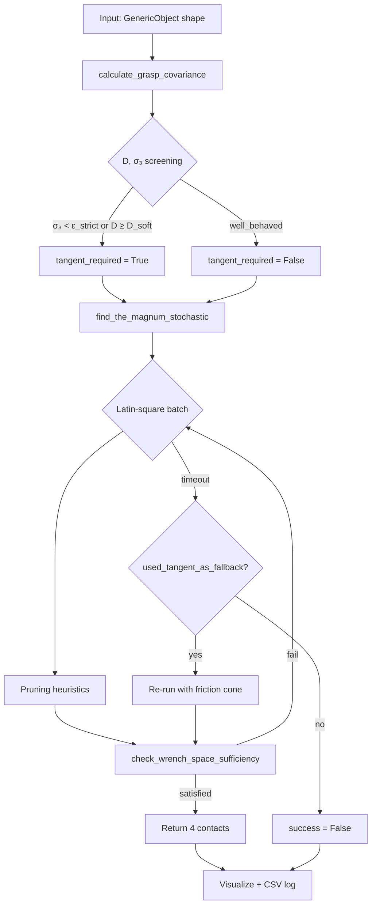

# Methodology Report: Stochastic Magnum AFC Configuration Search

**Script:** `scripts/test/test_stochastic_magnum.py`  
**Core solver:** `src/legacy/stochastic_magnum_finder.py` (`find_the_magnum_stochastic`)  
**Shape screening:** `src/legacy/grasp_covariance.py`  
**Theory reference:** `docs/afc_problem_B.md`

---

## 1. Problem statement

Given a planar rigid body \(\mathcal{O}\) with known geometry, mass \(m\), and friction coefficients, find **four contact placements** on \(\partial\mathcal{O}\) such that a team of four circular robots can **resist any wrench** within the object's **Limit Surface (LS)** using bounded contact forces.

This is **Augmented Force Closure (AFC)** at engineering threshold \(T = 1\):

$$
\mathcal{E}(T) \;\subseteq\; \mathcal{W}(\lambda; c),
$$

where \(c = \{p_1,\ldots,p_4\}\) is the contact configuration, \(\mathcal{W}(\lambda;c)\) is the **Grasp Wrench Set (GWS)**, and \(\mathcal{E}(T)\) is the LS ellipsoid scaled by threshold \(T\).

The test harness evaluates this pipeline on all **standard shapes** from `create_standard_objects()`, records success rates, and logs degeneracy screening statistics to CSV.

---

## 2. Pipeline overview

The methodology has three layers: **shape screening** (cheap, \(O(n)\) boundary samples), **combinatorial search** (Latin-square batches with early termination), and **geometric certification** (GWS vs LS in three projections).



**Default test parameters** (`test_stochastic_magnum.py`):

| Parameter | Default | Role |
|-----------|---------|------|
| `threshold` | \(1.0\) | LS scale factor \(T\) |
| `force_range_scalar` \(\lambda_{\mathrm{hw}}\) | \(2.0\) | Max normal force cap multiplier |
| `timeout` | \(10\) s | Per-shape search budget |
| `robot_radius` | \(0.06\) m | Robot spacing constraint |
| `samples_per_edge` | \(4\) | Boundary samples for \(M\) |
| `D_soft` | \(100\) | Soft degeneracy gate |

---

## 3. Wrench kinematics

### 3.1 Contact wrench column

For contact \(i\) with position \(\mathbf{r}_i\) (relative to centroid) and **inward** unit normal \(\mathbf{n}_i = (n_{i,x}, n_{i,y})\):

$$
\tau_i := r_{i,x}\, n_{i,y} - r_{i,y}\, n_{i,x},
\qquad
\mathbf{g}_i := \begin{pmatrix} n_{i,x} \\ n_{i,y} \\ \tau_i \end{pmatrix}.
$$

The grasp matrix is \(G = [\mathbf{g}_1\;\mathbf{g}_2\;\mathbf{g}_3\;\mathbf{g}_4] \in \mathbb{R}^{3\times 4}\).

**Implementation:** `ContactPoint.calculate_contact_wrench`, assembled in `WrenchSpaceVisualizer.calculate_wrench_space`.

### 3.2 Force cap and GWS (normal-only)

Static friction limit per contact (weight support):

$$
F_{\mathrm{static}} := \mu_s\, m g.
$$

With hardware multiplier \(\lambda\) (`force_range_scalar`):

$$
F_{\max} := \lambda\, F_{\mathrm{static}} = \lambda\,\mu_s\, m g.
$$

The **normal-only** grasp wrench set is a zonotope:

$$
\mathcal{W}(\lambda) = \left\{ \sum_{i=1}^{4} \alpha_i\, \mathbf{g}_i \;:\; 0 \le \alpha_i \le F_{\max} \right\}.
$$

### 3.3 Friction cone extension

When `enable_tangent_forces=True`, each contact contributes forces \((\alpha_i, \beta_i)\) with Coulomb constraint \(|\beta_i| \le \mu_\ell\, \alpha_i\). The enlarged set \(\mathcal{W}^{\mathrm{fric}}(\lambda)\) includes tangent wrench columns \(\mathbf{g}_i^{(t)}\) and generally has **non-zero torque span** even when normal columns have \(\tau_i = 0\) (circle case).

---

## 4. Limit Surface (LS)

The LS models the maximum resistible wrench under uniform pressure and Coulomb friction over the contact patch (numerically integrated in code).

**Translational cap:**

$$
f_{\max} = T \cdot \mu_s\, m g.
$$

**Rotational cap** (numerical integration over object area \(\mathcal{A}\)):

$$
m_{\max} = \mu_s \int_{\mathcal{A}} \|\mathbf{r}(\mathbf{x})\|\, p(\mathbf{x})\, dA,
\qquad p(\mathbf{x}) = \frac{m g}{|\mathcal{A}|}.
$$

The LS ellipsoid in \((F_x, F_y, \tau)\) is characterized by \((f_{\max}, m_{\max})\). Projections used for certification:

| Projection | LS boundary |
|------------|-------------|
| \((F_x, F_y)\) | Circle: \(\;F_x^2 + F_y^2 = f_{\max}^2\) |
| \((F_x, \tau)\) | Ellipse: \(\;(F_x/f_{\max})^2 + (\tau/m_{\max})^2 = 1\) |
| \((F_y, \tau)\) | Ellipse: \(\;(F_y/f_{\max})^2 + (\tau/m_{\max})^2 = 1\) |

**Implementation:** `WrenchSpaceVisualizer.calculate_limit_surface`.

---

## 5. Problem B: sufficiency test

### 5.1 Geometric condition

Full AFC at threshold \(T\) requires:

$$
\mathcal{E}(T) \subseteq \mathcal{W}(\lambda; c)
\quad\Longleftrightarrow\quad
\mathcal{E}(T)|_p \subseteq \mathcal{W}(\lambda; c)|_p
\;\;\forall p \in \{F_xF_y,\; F_x\tau,\; F_y\tau\}.
$$

### 5.2 Support-function characterization

For projection \(p\), let \(\mathbf{h}_i^{(p)} = P_p \mathbf{g}_i\). The projected GWS support function is:

$$
h_{\mathcal{W}_p}(u) = F_{\max} \sum_{i=1}^{4} \max\bigl(0,\; u^\top \mathbf{h}_i^{(p)}\bigr),
\qquad \|\mathbf{u}\| = 1.
$$

Define the **configuration support number**:

$$
\kappa_p(c) := \min_{\|\mathbf{u}\|=1} \sum_{i=1}^{4} \max\bigl(0,\; \mathbf{u}^\top \mathbf{h}_i^{(p)}\bigr).
$$

The projected LS is a disk of radius \(R = T\,\mu_s m g = T\, f_{\max}/T_{\mathrm{code}}\) (with code scaling). **Necessary and sufficient** for projection \(p\):

$$
\boxed{\;\mathcal{E}(T)|_p \subseteq \mathcal{W}_p(\lambda;c)
\;\Longleftrightarrow\;
h_{\mathcal{W}_p}(\mathbf{u}) \ge R \;\;\forall \|\mathbf{u}\|=1\;}
$$

which reduces to:

$$
\boxed{\;\lambda \;\ge\; \frac{T}{\kappa_p(c)}\;}
\qquad\text{(per projection)}.
$$

**Full AFC certificate:**

$$
\lambda_{\mathrm{config}}(c) = \max_{p} \frac{T}{\kappa_p(c)}.
$$

### 5.3 Computational test (hull containment)

`check_wrench_space_sufficiency` approximates \(\mathcal{W}(\lambda)\) by sampling feasible force combinations, takes the **convex hull** of projected wrenches, and tests that **all** \(n_{\mathrm{ellipse}}\) boundary samples of the scaled LS ellipse lie inside the hull (cross-product point-in-polygon test).

This is a **conservative numerical sufficient condition**: if the hull contains the LS boundary samples, the true zonotope contains the LS.

**Implementation:** `stochastic_magnum_finder.check_wrench_space_sufficiency` → `_check_wrench_space_sufficiency_vs_limit_surface`.

---

## 6. Shape screening: wrench covariance (Section 9–11)

Before search, `calculate_grasp_covariance` integrates normal-only wrench capacity over the **entire boundary** — an \(O(1)\)-per-shape statistic independent of any 4-tuple.

### 6.1 Local wrench field

At boundary point \(\mathbf{x}\) with inward normal \(\mathbf{n}(\mathbf{x})\), relative to CoM \(\mathbf{x}_{\mathrm{CoM}}\):

$$
\mathbf{g}(\mathbf{x}) = \begin{pmatrix} n_x \\ n_y \\ \tau(\mathbf{x}) \end{pmatrix},
\qquad
\tau = (x_x - x_{\mathrm{CoM},x})\, n_y - (x_y - x_{\mathrm{CoM},y})\, n_x.
$$

(Optional radius normalization scales \(\mathbf{r} = \mathbf{x} - \mathbf{x}_{\mathrm{CoM}}\) by \(\max_{\mathbf{x}\in\partial\mathcal{O}} \|\mathbf{r}\|\).)

### 6.2 Covariance matrix

Discrete approximation of the continuous integral:

$$
M = \oint_{\partial\mathcal{O}} \mathbf{g}(\mathbf{x})\,\mathbf{g}(\mathbf{x})^\top\, ds
\;\approx\;
\sum_{k} \mathbf{g}_k\,\mathbf{g}_k^\top\,\Delta s_k.
$$

\(M \in \mathbb{R}^{3\times 3}\) is symmetric positive semidefinite.

### 6.3 Eigenvalues and degeneracy index

Let \(\sigma_1 \ge \sigma_2 \ge \sigma_3 \ge 0\) be eigenvalues of \(M\). Define:

$$
\boxed{D = \frac{\sigma_1}{\sigma_3}}
\qquad
(\infty \text{ if } \sigma_3 = 0).
$$

| Regime | Condition | Interpretation |
|--------|-----------|----------------|
| **Well-behaved** | \(D < D_{\mathrm{soft}}\), \(\sigma_3 \gtrsim \varepsilon_{\mathrm{strict}}\) | Normal-only search likely at \(\lambda \approx 2\) |
| **Soft-degenerate** | \(D \ge D_{\mathrm{soft}}\) (default 100) | Torque capacity ill-conditioned; enable friction |
| **Strict-degenerate** | \(\sigma_3 < \varepsilon_{\mathrm{strict}}\) | \(\lambda_{\mathrm{shape}} = \infty\) for normal-only |

**Physical meaning:** \(D\) is the **condition number** of the shape's continuous normal-only wrench capacity. High \(D\) means the boundary can push hard in some wrench directions (\(\sigma_1\) large) but is nearly blind in the weakest direction \(\mathbf{u}_3\) (\(\sigma_3\) tiny).

### 6.4 Tangent fallback gate

`recommend_tangent_fallback` implements Section 11:

```
IF σ₃ < ε_strict           → tangent_required = True  (reason: strict_sigma3)
ELIF D ≥ D_soft            → tangent_required = True  (reason: soft_degenerate)
ELSE                       → normal-only first
```

In `test_stochastic_magnum.py`, this sets `tangent_required` and `use_tangent_fallback` before calling `find_the_magnum_stochastic`.

**Important:** \(D\) gates **friction mode**, not exact \(\lambda_{\mathrm{shape}}\). The star shape (\(D \approx 1.5\)) can fail at \(\lambda = 1.05\) while succeeding at \(\lambda \approx 1.6\) — low \(D\) does not guarantee low \(\lambda_{\mathrm{shape}}\).

### 6.5 Spectral lower bound (theory only — not used for gating)

From Section 10, when \(\sigma_3 > 0\):

$$
\lambda_{\mathrm{shape}} \;\ge\; C\,\sqrt{D},
\qquad
C = \frac{T}{4\sqrt{K\,\sigma_1}},
$$

where \(K\) is a Sobolev constant bounding peak boundary wrench in the weakest direction. The discrete estimator `lambda_shape_lower_bound` is logged but **must not gate the pipeline** (Sobolev singularity can make \(\lambda_{\mathrm{Floor}}\) misleading when \(D\) is huge).

---

## 7. Stochastic search: Latin square (Problem C)

`find_the_magnum_stochastic` searches over 4-contact configurations without exhaustive edge combinatorics.

### 7.1 Setup (excluded from timeout)

1. **Edge characterization:** `EdgeCharacterizer` decomposes \(\partial\mathcal{O}\) into logical edges; each edge has fixed force direction \((f_x, f_y)\) and linear torque law \(\tau(t) = \alpha t + \beta\).

2. **Maximum inscribed circles:** LP (convex) or Voronoi (non-convex) to find tangency points for strategic sampling.

3. **Strategic contact samples** per edge \(e\):
   - Near-corner points (\(t = t_{\mathrm{start}} + \varepsilon\), \(t_{\mathrm{end}} - \varepsilon\))
   - Midpoint and quartiles
   - No-torque point: \(\tau(t) = 0 \Rightarrow t = -\beta/\alpha\)
   - Tangency points from inscribed circles
   - \(\varepsilon\)-offsets (computed from `compute_epsilon`)

Let \(\mathcal{S} = \{(e_j, t_j)\}_{j=1}^{N}\) be the flattened list, \(N = |\mathcal{S}| \ge 4\).

### 7.2 Latin square batches

Each batch builds a **Latin square** \(L \in \mathbb{Z}^{N \times 4}\): each of the 4 columns is a random permutation of \(\{0,\ldots,N-1\}\).

Row \(r\) assigns robot \(k\) the strategic point \(\mathcal{S}[L_{r,k}]\):

$$
c_r = \bigl\{ \mathcal{S}[L_{r,1}],\; \mathcal{S}[L_{r,2}],\; \mathcal{S}[L_{r,3}],\; \mathcal{S}[L_{r,4}] \bigr\}.
$$

**Design property:** each strategic point appears exactly once per robot column across all rows in a batch, giving **uniform coverage** without clustering (unlike independent random sampling).

### 7.3 Engineering pruning (before sufficiency test)

For each candidate \(c_r\), apply cheap filters:

| Check | Condition | Purpose |
|-------|-----------|---------|
| Distinct points | \(\|\mathbf{p}_i - \mathbf{p}_j\| \ge \varepsilon\) | Avoid duplicate contacts |
| Robot spacing | \(\|\mathbf{c}_i^{\mathrm{robot}} - \mathbf{c}_j^{\mathrm{robot}}\| \ge 2r + \delta\) | Physical non-collision |
| Non-parallel normals | \(\exists\) pair with angle \(> 2°\) | Force closure prerequisite |
| Quick FC | Angular gaps \(< \pi\) | Normals not in one half-plane |

Robot center: \(\mathbf{c}_i^{\mathrm{robot}} = \mathbf{p}_i + r_{\mathrm{robot}}\,\mathbf{n}_i^{\mathrm{outward}}\).

### 7.4 Anytime early termination

If `check_wrench_space_sufficiency` returns `satisfied=True`, return immediately. Search continues in new Latin-square batches until `timeout`.

**Pass structure:**

| Mode | Pass 1 | Pass 2 |
|------|--------|--------|
| Default | Normal-only, full timeout | — |
| `used_tangent_as_fallback` | Normal-only, \(\frac{1}{2}\) timeout | Friction cone, \(\frac{1}{2}\) timeout, no quick FC prune |
| `tangent_required` | Skip | Friction cone, full timeout |

---

## 8. Theoretical results and proofs

### 8.1 Theorem (strict normal-only degeneracy on smooth convex bodies)

**Statement.** Let \(\partial\mathcal{O}\) be \(C^1\) strictly convex with centroid at the curvature center. For any normal contact, \(\mathbf{r} \parallel \mathbf{n}\), hence \(\tau = \mathbf{r} \times \mathbf{n} = 0\). Every normal-only wrench satisfies \(\tau = 0\):

$$
\mathcal{W}(\lambda) \subseteq \mathbb{R}^2 \times \{0\}.
$$

Since the LS has \(m_{\max} > 0\) for \(\mu_s > 0\), for **any** finite \(\lambda\):

$$
\mathcal{E}(1) \not\subseteq \mathcal{W}(\lambda)
\quad\Rightarrow\quad
\lambda_{\mathrm{shape}} = \infty.
$$

**Corollary (friction necessity).** Normal-only full AFC is impossible on the frictionless circle; tangent forces are **required**.

---

### 8.2 Proposition (\(\kappa_p = 0 \Rightarrow\) configuration failure)

If \(\kappa_p(c) = 0\) for some projection \(p\), then \(\exists \mathbf{u}^*, \|\mathbf{u}^*\| = 1\) with \(h_{\mathcal{W}_p}(\mathbf{u}^*) = 0\). The LS disk has radius \(R > 0\) when \(T > 0\), so:

$$
\lambda_{\mathrm{config}}(c) = \infty
\quad\text{for that placement } c.
$$

This certifies **configuration** failure, not shape failure, unless \(\kappa_p(c) = 0\) for **all** \(c \in \mathbb{C}\).

*Example:* mid-edge symmetric rectangle has \(\kappa_{F_x\tau} = \kappa_{F_y\tau} = 0\) but other placements succeed.

---

### 8.3 Lemma (two-contact support in direction \(\mathbf{u}\))

If only contacts \(a, b\) are active with force directions \(\mathbf{f}_a, \mathbf{f}_b\) and angle \(\varphi\) between them, maximizing along bisector \(\mathbf{u}\):

$$
\max_{\substack{0 \le \alpha_a, \alpha_b \le F_{\max}}} \mathbf{u}^\top(\alpha_a \mathbf{f}_a + \alpha_b \mathbf{f}_b)
= F_{\max}\,\|\mathbf{f}_a + \mathbf{f}_b\|
= 2 F_{\max} \cos(\varphi/2).
$$

Hence for four quadrant contacts on a circle, \(\kappa_{xy} > 0\) (translational AFC feasible at finite \(\lambda\)) even when torque projections fail.

---

### 8.4 Theorem (spectral lower bound — proof sketch)

**Statement.** If \(\sigma_3 > 0\), there exists \(C > 0\) such that:

$$
\lambda_{\mathrm{shape}} \;\ge\; C\,\sqrt{D}.
$$

**Proof sketch (4 steps).**

**Step 1 — Weakest eigenvector.** Let \(\mathbf{u}_3\) be the unit eigenvector for \(\sigma_3\). By the Rayleigh quotient:

$$
\sigma_3 = \oint ( \mathbf{u}_3^\top \mathbf{g}(s) )^2\, ds.
$$

Write \(f(s) = \mathbf{u}_3^\top \mathbf{g}(s)\).

**Step 2 — Discrete support bound.** For any 4-contact placement \(\{s_1,\ldots,s_4\}\):

$$
S(c, \mathbf{u}_3) := \sum_{i=1}^{4} \max(0, f(s_i)) \;\le\; 4\, f_{\max},
\qquad f_{\max} := \max_{s \in \partial\mathcal{O}} |f(s)|.
$$

**Step 3 — Sobolev bridge.** On a \(C^1\) closed curve of length \(L\) with bounded curvature of \(\mathbf{g}(s)\):

$$
f_{\max} \;\le\; \sqrt{K\,\sigma_3}
\quad\Rightarrow\quad
S(c, \mathbf{u}_3) \;\le\; 4\sqrt{K\,\sigma_3}
\quad\forall c.
$$

**Step 4 — Link to \(\kappa_p\).** Rotate frame so \(\mathbf{u}_3\) lies in projection \(p^*\). Then:

$$
\kappa_{p^*}(c) \;\le\; S(c, \mathbf{u}_3) \;\le\; 4\sqrt{K\,\sigma_3}.
$$

Therefore:

$$
\lambda_{\mathrm{shape}}
= \min_c \max_p \frac{T}{\kappa_p(c)}
\;\ge\; \frac{T}{4\sqrt{K\,\sigma_3}}
= \frac{T}{4\sqrt{K\,\sigma_1}}\,\sqrt{\frac{\sigma_1}{\sigma_3}}
= C\,\sqrt{D}.
\qquad\square
$$

**Caveat:** This is a **weak lower bound**. The discrete \(\lambda_{\mathrm{Floor}}\) from Sobolev estimates is not tight enough for engineering gating (see Section 11 Sobolev singularity in `afc_problem_B.md`).

---

### 8.5 Shape vs configuration bounds

$$
\lambda_{\mathrm{config}}(c) = \max_p \frac{T}{\kappa_p(c)}
\qquad\text{(fixed 4-tuple)}
$$

$$
\lambda_{\mathrm{shape}} = \min_{c \in \mathbb{C}} \lambda_{\mathrm{config}}(c)
\qquad\text{(intrinsic shape difficulty)}.
$$

| Quantity | Answers |
|----------|---------|
| \(\lambda_{\mathrm{config}}(c)\) | Did **this** placement fail? |
| \(\lambda_{\mathrm{shape}}\) | Is the **shape** fundamentally hard? |
| \(D, \sigma_3\) | Should we use friction before searching? |
| Search result | Does a valid \(c\) exist at hardware \(\lambda\)? |

---

## 9. Test harness methodology

### 9.1 Per-shape workflow

For each shape in `create_standard_objects()`:

1. **Screen:** `calculate_grasp_covariance(obj, samples_per_edge=4)`
2. **Gate:** `recommend_tangent_fallback(cov, soft_degeneracy_threshold=D_soft)`
3. **Search:** `find_the_magnum_stochastic(...)` with engineering defaults
4. **Visualize:** 4-panel figure (contacts + 3 GWS/LS projections) on success
5. **Log:** CSV row with \(\sigma_1, \sigma_2, \sigma_3, D\), classification, timing, configs tested

### 9.2 Success criterion

A shape **passes** iff the search returns `success=True` with four `ContactPoint` objects satisfying:

$$
\mathcal{E}(T=1) \subseteq \mathcal{W}(\lambda_{\mathrm{hw}}; c)
\quad\text{in all three projections,}
$$

with optional friction cone if tangent mode was used.

### 9.3 CLI modes

| Flag | Effect |
|------|--------|
| `--force-tangent` | Skip normal-only; full friction search |
| `--ignore-degeneracy-gate` | Ignore \(D\); normal-only unless `--retry-tangent-on-failure` |
| `--retry-tangent-on-failure` | Section 11 step 3: retry with friction if normal-only fails |
| `--soft-threshold` | Override \(D_{\mathrm{soft}}\) |
| `--force-range-scalar` | Override \(\lambda_{\mathrm{hw}}\) |

---

## 10. Implementation map

| Mathematical object | Function / module |
|---------------------|-------------------|
| \(\mathbf{g}_i\), \(G\) | `ContactPoint.calculate_contact_wrench` |
| \(\mathcal{W}(\lambda)\) | `WrenchSpaceVisualizer.calculate_wrench_space` |
| \(\mathcal{E}(T)\), \((f_{\max}, m_{\max})\) | `WrenchSpaceVisualizer.calculate_limit_surface` |
| Problem B test | `check_wrench_space_sufficiency` |
| \(M\), \(\sigma_i\), \(D\) | `calculate_grasp_covariance` |
| Tangent gate | `recommend_tangent_fallback` |
| Latin-square search | `find_the_magnum_stochastic` |
| \(\kappa_p(c)\) (exact) | `verify_afc_problem_B_bounds.py` |
| Test orchestration | `test_stochastic_magnum.py` |

---

## 11. Summary equations (quick reference)

$$
\boxed{
\begin{aligned}
&\text{AFC (full):} && \mathcal{E}(T) \subseteq \mathcal{W}(\lambda; c) \\[4pt]
&\text{Per projection:} && \lambda \;\ge\; T / \kappa_p(c) \\[4pt]
&\text{Shape bound:} && \lambda_{\mathrm{shape}} = \min_c \max_p \; T/\kappa_p(c) \\[4pt]
&\text{Covariance:} && M = \oint \mathbf{g}\,\mathbf{g}^\top ds \\[4pt]
&\text{Degeneracy index:} && D = \sigma_1 / \sigma_3 \\[4pt]
&\text{Force cap:} && F_{\max} = \lambda\,\mu_s\, m g \\[4pt]
&\text{Spectral bound (theory):} && \lambda_{\mathrm{shape}} \gtrsim C\sqrt{D}
\end{aligned}
}
$$

---

## 12. Limitations and scope

1. **Sampling approximation:** GWS is sampled, not exact LP zonotope; hull containment is conservative but not exact.
2. **2D planar:** Method assumes planar pushing; wrenches are 3-vectors \((F_x, F_y, \tau)\).
3. **Configurable contact count:** Default Magnum is \(n=4\); `n_contacts` generalizes the Latin square. Three-contact AFC always uses friction and needs a higher \(\mu_{\mathrm{contact}}\) than four-contact degenerate cases (Section 13).
4. **\(D\) is screening, not prediction:** Low \(D\) does not certify \(\lambda = 1.05\); high \(D\) strongly suggests friction **for \(n=4\)**. For \(n=3\), \(D\) does **not** predict which shapes fail at \(\mu = 0.2\).
5. **Timeout-based search:** Failure may mean \(\lambda_{\mathrm{shape}} > \lambda_{\mathrm{hw}}\) or insufficient search time, not necessarily impossibility.

---

## 13. Empirics: \(n=4\) vs \(n=3\) and contact friction \(\mu\)

Harness: `test_markenscoff_form_closure.py` / `run_markenscoff_full_benchmark.py` (July 2026). Finder API: `find_the_magnum_stochastic(..., n_contacts=k)`.

### 13.1 Form-closure proxy (\(T = 10^{-3}\))

| Run | Result |
|-----|--------|
| \(n=4\) frictionless | Most polygons pass; **circle** fails (torque-null normals); `narrow_triangle` timed out |
| \(n=3\) + friction | **22/22** pass |

### 13.2 Full AFC (\(T=1\), \(\lambda = 2\))

**Four contacts (Section 11 pipeline):**

- Well-behaved (\(D \lesssim D_{\mathrm{soft}}\)): normal-only usually succeeds.
- Soft/strict degenerate: enable friction; \(\mu_{\mathrm{contact}} \approx 0.2\) is typically enough.

**Three contacts (always friction):**

| \(\mu_{\mathrm{contact}}\) | Pass / 22 | Note |
|--------------------------|-----------|------|
| \(0.2\) | 13 (~59%) | Nine failures listed below |
| \(0.5\) | all nine recovered | \(\mu = 0.8\) unused |

Failures at \(\mu = 0.2\): asym_l_shape, boot, l_shape, narrow_triangle, obese_triangle, plus, rectangle, t_shape, u_shape.

### 13.3 Screening check on those nine failures

\(D = \sigma_1/\sigma_3\) was recomputed (no search) for FAIL vs PASS at \(\mu = 0.2\):

- FAIL: median \(D \approx 5.2\); **7/9 well_behaved**; only narrow/obese triangle soft-degenerate.
- PASS: median \(D \approx 6.2\); **circle** (\(D \approx 10^3\)) **passes**.

So the \(n=3\) shortfall at \(\mu = 0.2\) is **not** explained by the degeneracy gate. Theory detail and operational table: **`docs/afc_problem_B.md` §14**.

---

## 14. \(n=3\) AFC is binary; *pushing quality* is not (open)

**Observation (2026-08-17, `root`, holonomic stick).** Two 3-contact placements both pass `check_wrench_space_sufficiency` with tangent forces (\(T=1\), \(\lambda=2\), \(\mu_{\mathrm{contact}}=0.5\)). Only one can execute the first planned SE(2) primitive. So “still AFC” is necessary but not sufficient for multi-robot pushing.

### 14.1 Same equations, different numbers

Recall \(\mathbf{g}_i = (n_{i,x},\, n_{i,y},\, \tau_i)\) with \(\tau_i = r_{i,x}n_{i,y}-r_{i,y}n_{i,x}\) and

$$
\kappa_{xy}(c) = \min_{\|u\|=1}\sum_i \max(0,\, u\cdot\mathbf{n}_i).
$$

AFC (GWS \(\supseteq\) LS) can hold via the **friction cone** even when \(\kappa_{xy}=0\) (a hole in the *normal-only* force cone). Pushing feed-forward is mostly **normal + rigid twist**; a \(\kappa_{xy}=0\) slot then produces the wrong planar wrench as soon as one bumper drops.

| Placement | \(t\) | AFC \(N\) | AFC \(N{+}\tau\) | \(\kappa_{xy}\) | \(\min_i |r_i|\) | \(\min_i \mathbf{n}_{\mathrm{out}}\cdot\hat{r}_i\) | First segment |
|-----------|-------|-----------|------------------|-----------------|-------------------|-----------------------------------------------------|---------------|
| Stochastic first-hit (cache) | \(0.388,\,0.721,\,0.944\) | no | **yes** | **0** | \(0.10\) m (notch) | **\(-0.98\)** | fail (wrong \(\omega\), \(+y\)) |
| Mid-edge search (e3,e5,e8) | \(0.312,\,0.492,\,0.701\) | no | **yes** | **0.63** | \(0.35\) m | **\(+0.63\)** | pass \((1.00,1.53)@120^\circ\) |

The miserably failing contact is **mid-edge of a concave notch**, not a corner: \(t=0.944\) has local \(t=0.5\) on e10, but \(\mathbf{n}_{\mathrm{out}}\) points **toward** the COM. Then \(\mathbf{n}_{\mathrm{in}}\approx -\hat{r}\), so \(\tau \approx 0\), the robot sits near the COM, and \(\kappa_{xy}=0\).

**What changed in the equation:** not the AFC predicate (both True with tangent). \(\kappa_{xy}\), \(\min|r|\), and \(\mathbf{n}_{\mathrm{out}}\cdot\hat{r}\) changed. Those are the current “good” metrics.

### 14.2 How to compare two \(n=3\) configs (working list)

Use after the binary AFC test, in this order:

1. \(\kappa_{xy}(c)\) — reject \(\approx 0\) even if AFC+\(\tau\) passes.
2. \(\min_i \mathbf{n}_{\mathrm{out},i}\cdot\hat{r}_i\) — reject \(\le 0\) (notch / inward “outward”).
3. \(\min_i |r_i|\) — reject contacts whose intended disk overlaps the COM.
4. Corner clearance \(\min(\alpha,1-\alpha)\) on the logical edge — prefer mid-edge on *convex* edges.
5. Robot-center gap \(> 2R+\delta\).

Script: `scripts/test/audit_n3_root_contacts.py`.

### 14.3 How to find a better one *inside* Latin square (not done yet)

`find_the_magnum_stochastic` is **anytime**: it returns the **first** AFC hit. That is why the notch triple was cached.

To keep stochastic + Latin square but rank:

- Do **not** return on first `satisfied`.
- Keep a bounded elite set; score with §14.2.
- Optionally bias the strategic sampler: down-weight samples with \(\mathbf{n}_{\mathrm{out}}\cdot\hat{r}\le 0\) or \(|r|\) below a fraction of the mean radius (still sample them — they can be AFC, just not “good”).
- For \(n=3\), prefer 3 **distinct logical edges**.

This section is a note for a later dive, not a finished ranking theory.

---

*Generated from the implementation in `contact_maintain` (updated August 2026). For extended proofs and worked examples, see `docs/afc_problem_B.md`.*
